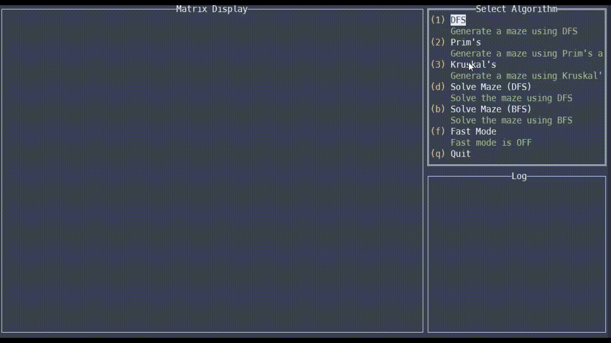
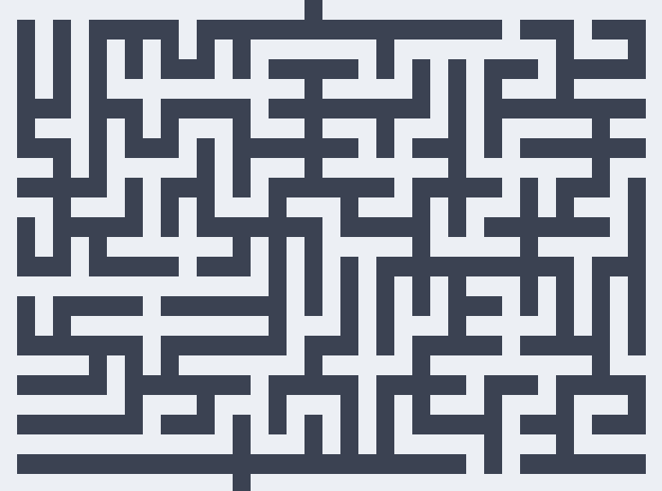

# A Maze built with Go

Nothing fancy, just wanted to explore some Graph Algorithms and learn a bit about Goroutines plus creating some simple TUI.

It was one hell of a ride getting this to work - from figuring out how to perfectly align the walls (padding), to carving paths through the marble plate of ASCII characters, and finally connecting the logs, display, and algorithm list together using Go structs and Goroutines.

This project leverages tview, a powerful terminal UI library for Go that offers rich text formatting and interactive components. Rather than creating another static website to experiment with maze algorithms, I decided to change it up a bit and build an interactive terminal application instead. This basically allow me to focus more on the algorithms and Go instead of having to worry about div, and alignments even though I did ran into a padding issue a bit.

I have plan to make more maze, in the future, when I have more time. Maybe a Maze Runner inspired maze and a circular maze or even a dungeon maze like in Path of Exile.
Who knows, but one thing is clear, I need a way to make my wall smaller to support more paths to carve.

The maze are generated with the following algorithms:
- [Prims Algorithm](https://en.wikipedia.org/wiki/Prim%27s_algorithm)
- [Depth-first search](https://en.wikipedia.org/wiki/Depth-first_search)
- [Kruskal's Algorithm](https://en.wikipedia.org/wiki/Kruskal%27s_algorithm)

### Demo



### Usage

If you want to run the program, and check out the code
```bash
go run . 
```

If you want to build and run it entirely
```bash
go build .
```

Run the program on Linux/Mac
```bash
./crete
```

Run the program on Windows
```bash
crete.exe
```

### Disclaimer

If you decide to snip around the code and notice that everything is plus 2, divided by 2, or multiplied by 2, it's because I'm using the block ascii characters to draw my maze, and '█' doesn't actually make a good square-ish shape block for horizontal and vertical walls, so I double it up to make it look more appealing in the terminal instead of using characters like '|' or '─'.

This way it can look like this:
Notice how the corners are align to each other perfectly, that is what I'm to achieve.


Most of the logic that I use to create the maze can be credited to the author of [this article](http://weblog.jamisbuck.org/under-the-hood/). I mearly followed and applied the logic to my code with a pinche of custom logic (double blocks and event tracker)


### Credits
Shoutouts to these articles in helping me understand how maze generation works

[prims algo pseudocode](https://www.freecodecamp.org/news/prims-algorithm-explained-with-pseudocode/)
[depth first search](https://www.algosome.com/articles/maze-generation-depth-first.html)
[backtracking](https://medium.com/swlh/maze-generation-with-depth-first-search-and-recursive-backtracking-869f5c4496ad)
[maze research](https://professor-l.github.io/mazes/)
[prims algo](https://weblog.jamisbuck.org/2011/1/10/maze-generation-prim-s-algorithm)


